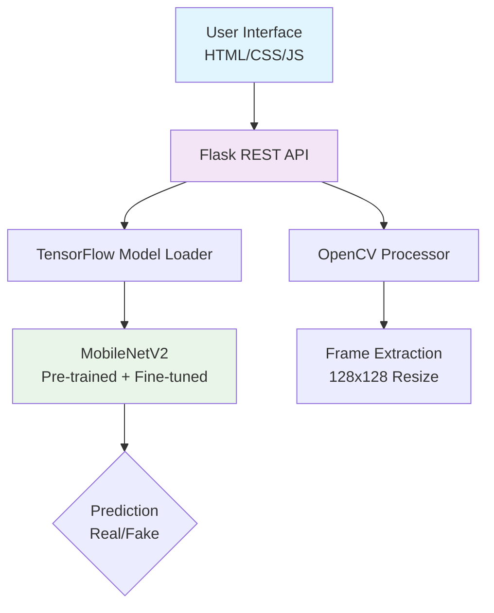

<div align="center">

# 🚀 DeepShield - AI Deepfake Detection Platform

[](https://github.com/yourusername/deepshield)
[](LICENSE)
[](https://www.python.org/)
[](https://www.tensorflow.org/)

</div>

<div align="center">

**Advanced AI-powered platform to detect deepfakes in images & videos instantly. Built with TensorFlow, Flask & MobileNetV2.**


https://github.com/user-attachments/assets/8bc6f3ef-ccf1-4935-a232-d4013e7ef3f4


</div>

<br>

## 🎯 **Problem Solved**

**Deepfakes threaten cybersecurity, media integrity, and personal security.** DeepShield provides:

- **Instant detection** of synthetic images/videos
- **Production-grade web interface** with drag-and-drop UX
- **Scalable video processing** (500MB files)
- **Educational resources** for deepfake awareness


## ✨ **Key Features**

| **Feature** | **Technical Implementation** | **Business Value** |
|-------------|-----------------------------|-------------------|
| **🖼️ Image Detection** | PNG/JPG up to 50MB, <1s analysis | Instant verification for social media/news |
| **🎬 Video Analysis** | MP4/AVI up to 500MB, frame sampling | Enterprise-grade video forensics |
| **📊 Confidence Scores** | Real-time animated progress bars | Actionable threat intelligence |
| **🎨 Drag & Drop UI** | HTML5 File API + CSS animations | User-friendly for non-technical users |
| **📚 Learning Hub** | Deepfake science + detection techniques | Security awareness training |

## 🏗️ **System Architecture**



## 🚀 **Production Deployment**

### **Prerequisites**
- Python 3.8+
- 4GB+ RAM (model inference)
- 2GB disk space (model + dependencies)

### **1-Click Setup**
```bash
git clone https://github.com/yourusername/deepshield.git
cd deepshield
python -m venv venv
source venv/bin/activate  # Linux/Mac
# venv\Scripts\activate   # Windows

pip install -r requirements.txt
python app.py
```
**URL:** http://localhost:5000

## 📈 **Real-World Results**
🖼️ Image Processing:
├── Input: sample.jpg (2.1MB)
├── Processing: 847ms
├── Result: FAKE
└── Confidence: 82.34%

🎬 Video Processing:
├── Input: sample.mp4 (127MB)
├── Frames Analyzed: 127 (skip=5)
├── Fake Frames: 64 (50.4%)
├── Real Frames: 63 (49.6%)
└── Processing: 28.4 seconds

## 🔬 **AI Model Details**

### **Architecture**
Input Layer: 128x128x3 RGB images
↓
MobileNetV2 (ImageNet pretrained)
- 20 bottom layers frozen
- 20 top layers fine-tuned
↓
GlobalAveragePooling2D
↓
Dense(128, ReLU) + Dropout(0.5)
↓
Sigmoid Output (0=Real, 1=Fake)

### **Training Configuration**
Dataset: Real + Deepfake images (balanced)
Image Size: 128x128
Batch Size: 16
Epochs: 15 (EarlyStopping patience=3)
Augmentation: Rotation(15°), Zoom(20%), Flip
Optimizer: Adam
Loss: Binary Crossentropy
Validation: 80/20 split

## 🛠 **Production Features**

| **Security** | **Scalability** | **UX** |
|--------------|----------------|--------|
| ✅ MIME validation | ✅ 500MB file limits | ✅ Drag & drop |
| ✅ Auto file cleanup | ✅ Frame skip optimization | ✅ Mobile responsive |
| ✅ No data persistence | ✅ Memory-optimized model | ✅ Loading animations |
| ✅ Error boundaries (400/413/500) | ✅ <500MB peak memory | ✅ Confidence visualization |

## 📁 **Codebase Structure**
deepshield/
├── app.py # Flask API + Model Loader
├── train.py # Model Training Pipeline
├── predict_image.py # CLI Image Detection
├── predict_video.py # CLI Video Detection
├── index.html # Single-page React-like UI
├── model/
│ └── deepfakemodel.h5 # 10MB Optimized Model
├── static/ # CSS Grid + Animations
├── uploads/ # Secure temp storage
└── requirements.txt # TensorFlow, Flask, OpenCV

## 🔍 **Technical Workflow**
DRAG & DROP → File API validation

PREPROCESS → OpenCV (resize 128x128, normalize)

INFERENCE → TensorFlow (MobileNetV2 → Sigmoid)

VISUALIZE → CSS animations + confidence bars

CLEANUP → Secure file deletion

## 🎓 **Educational Value**

**Learning Hub covers:**
- **Deepfake generation** (GANs, autoencoders)
- **Detection challenges** (lighting, blinking, metadata)
- **AI techniques** (CNN, RNN, ensemble methods)
- **Future trends** (blockchain, quantum detection)

## 💼 **Skills Demonstrated**

✅ **Full-Stack Development** (Flask + Modern HTML/CSS/JS)  
✅ **Machine Learning** (TensorFlow, Transfer Learning)  
✅ **Computer Vision** (OpenCV preprocessing)  
✅ **Production Engineering** (Error handling, security)  
✅ **DevOps** (Virtualenv, dependency management)  
✅ **Cybersecurity** (Secure file handling, no persistence)

## 🚀 **Future Enhancements**

- [ ] Audio deepfake detection
- [ ] Real-time webcam analysis  
- [ ] Docker containerization
- [ ] REST API documentation (Swagger)
- [ ] Model monitoring + retraining pipeline

## 🤝 **Contributing**

```bash
1. Fork → Clone → Create feature branch
2. `git checkout -b feature/deepfake-audio`
3. Commit → Push → Pull Request
```

**Good first issues:** UI polish, model accuracy, documentation
